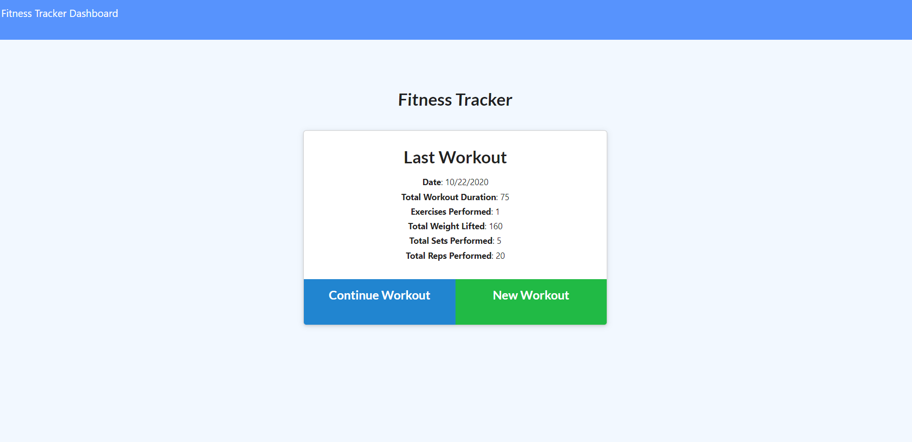
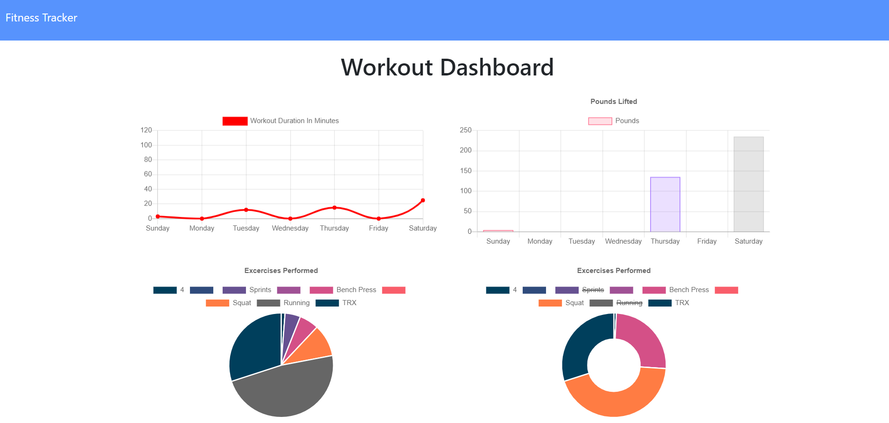

# Workout Tracker!

## Description 

This is a full stack application that is designed to help users keep track of their own workouts and exercises. In addition, it provides a beautiful graph with stats to help users visualize their work!

## Table of Contents 

* [Description](#Description)
* [Installation](#Installation)
* [Usage](#Usage)
* [Credits](#Credits)
* [License](#License)
* [Contributions](#Contributions)
* [Tests](#Tests)
* [Questions](*Questions)

## Installation

In order to install, simply type in "npm install" into your node terminal and it will do the rest

## Usage

If running from node, simply run "node server.js" and then you can navigate to the page in your browser. You can then create a new workout, and it will save. Then head to the dashboard to see your graphs. If on Heroku, you can simply use the program without having to run server side code.

## Credits

ME! Alex Varela

## License

MIT

## Contributing

Open source! Use if you must.

## Tests

No tests were designed for this application.

## Questions

Contact me through email or GitHub!

Reach out to me!

Email: alexvar93@gmail.com
GitHub Profile: fatmoogle || github.com/fatmoogle 

---
© 2019 Trilogy Education Services, a 2U, Inc. brand. All Rights Reserved.

